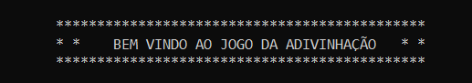
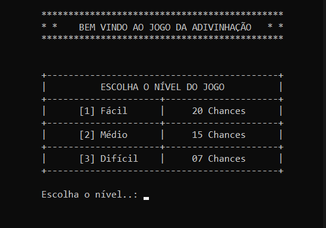
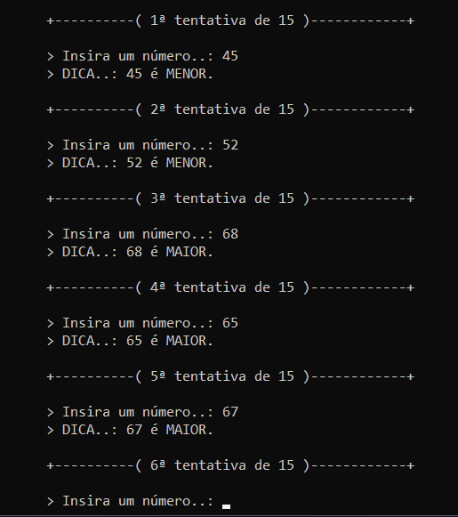
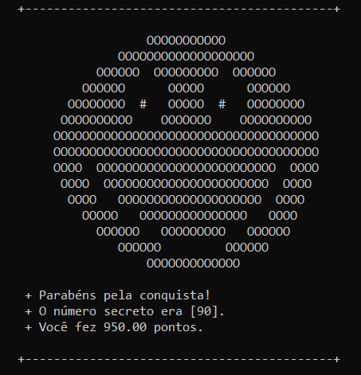
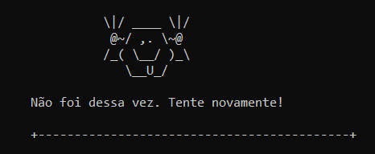

***

**🔥 Esse projeto foi feito na linguagem `C` para obter base de conhecimento sobre a linguagem.**

 

**`🎮 Menu Inicial`**

**O jogo começa com o menu de escolha onde o jogador pode escolher o nível do jogo.**  
***`[1] Fácil - 20 chances` `[2] Médio - 15 chances` `[3] Difícil - 07 chances`***

##

**`🎲 Chute um numero`**

**Após definir o nivel do jogo, informe o numero que você acredita ser o numero secreto, após inserir o numero será mostrado se o jogador acertou ou não o numero, enquanto não acertar o numero será informado o ultimo numero inserido pelo jogador com uma dica, informando para o jogador se o ultimo numero e *`Menor`* ou *`Maior`* que o numero secreto.**

##

**`🏆 Vitoria do Jogador`**

**Quando o jogador acertar o numero secreto, será apresentado o emoje abaixo no console do computador, informando que o jogador acerou o numero secreto.**

##

**`❌ Derrota do Jogador`**

**Caso o jogador seja derrotado no jogo o emoje abaixo será mostrado no console do computador, informando que o jogador não acertou o numero secreto dentro das tentativas que o mesmo teve para acertar, conforme nível do jogo definido pelo mesmo.**

##

**`🚀 Tecnologias`**

  
  
  

 

**:octocat: Made by `Mateus Barros`**

***
